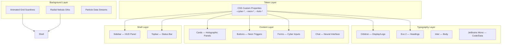
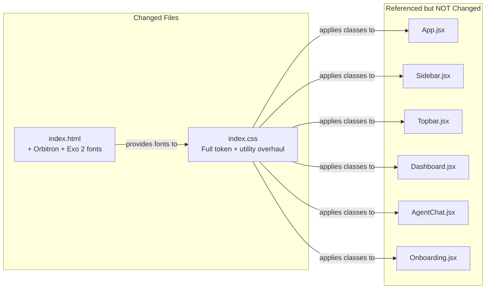

# Design Document: Futuristic Career Coach UI

## Overview

SkillLens is a React + Vite (JSX) career coaching application that uses AI reasoning to guide users through skill gap analysis, mock interviews, resume building, career dashboards, and job tracking. The current UI already has a dark design foundation (deep navy backgrounds, indigo/violet palette, glass-morphism cards, Outfit/Inter typography, framer-motion animations). This overhaul elevates that foundation into a full **Futuristic Reasoning Agent** aesthetic — a sci-fi HUD experience with neon cyan/electric blue color shifts, animated grid scanlines, holographic panel borders, Orbitron/Exo 2 typography for headings, particle/data-stream backgrounds, glowing status indicators, and an interface that visually communicates "a superintelligent agent is processing your career data."

The redesign is purely a CSS/frontend aesthetic change. No backend endpoints, data models, or React component logic change — only `index.css` (global tokens + utility classes), `index.html` (font imports), and per-component inline style patterns are updated. This means zero risk to the application's functional correctness.

---

## Architecture

The design system is layered as follows:



### File Change Map



---

## Visual Design Language

### Color Palette — "Neural Neon"

| Token | Value | Role |
|---|---|---|
| `--bg-primary` | `#020510` | Deepest void black-blue |
| `--bg-deep` | `#010308` | True void for scanline bg |
| `--surface` | `#080d1a` | Card surface |
| `--surface-2` | `#0d1525` | Input background |
| `--surface-3` | `#121d2e` | Elevated panels |
| `--cyber-cyan` | `#00f5ff` | Primary neon — HUD accents |
| `--cyber-blue` | `#0ea5e9` | Secondary — links, info |
| `--cyber-violet` | `#7c3aed` | Tertiary — accent nodes |
| `--cyber-magenta` | `#e879f9` | Warning/hot accents |
| `--cyber-green` | `#00ff88` | Success / online status |
| `--neon-glow-cyan` | `rgba(0,245,255,0.35)` | Cyan bloom shadow |
| `--neon-glow-violet` | `rgba(124,58,237,0.4)` | Violet bloom shadow |
| `--holo-border` | `rgba(0,245,255,0.18)` | Holographic border |
| `--grid-line` | `rgba(0,245,255,0.04)` | Background grid |

The shift from the existing indigo/violet palette to **cyan-dominant neon** is the key visual transformation. Cyan (`#00f5ff`) becomes the primary HUD color, evoking classic sci-fi interfaces (TRON, Westworld, Ex Machina).

### Typography

```
Display / Logo:   Orbitron 700-900  → page titles, logo wordmark, stat values
Headings (h2-h4): Exo 2 600-700    → section headers, card titles
Body:             Inter 400-500     → paragraph text, nav labels (unchanged)
Mono/Data:        JetBrains Mono    → code, timestamps, data readouts
```

Orbitron gives the unmistakable "future computer" feel. Exo 2 bridges it to readable headings. Inter keeps body text legible.

### Background System

Three overlapping background layers create the sci-fi environment:

1. **Animated Grid** — A CSS `background-image` with two perpendicular `linear-gradient` lines at `--grid-line` opacity, animating a slow vertical scroll to create a "scanline" effect.
2. **Radial Nebula Orbs** — The existing `.bg-orb` system, recolored to cyan and violet with opacity lifted from 5% to 8–12%, creating a pulsing nebula.
3. **Corner HUD Brackets** — CSS `::before`/`::after` pseudo-elements on `.glass-card` and `.sidebar` that draw corner bracket lines (like targeting reticles) using `border-left` + `border-top` on absolutely-positioned divs.

### HUD Frame Elements

Panels (cards, sidebar, topbar, modals) adopt a "holographic display" aesthetic:

- **Borders**: `1px solid var(--holo-border)` — faint cyan
- **Box shadows**: Multi-layer: outer glow + inner inset + drop
- **Corner brackets**: CSS pseudo-element corner lines on key containers
- **Scanline texture**: Subtle `repeating-linear-gradient` overlay on panel backgrounds
- **Active borders**: Glowing cyan left-accent stripe on active nav items and agent messages

---

## Components and Interfaces

### Component: Global CSS Design Tokens (`index.css`)

**Purpose**: Single source of truth for all design tokens, keyframe animations, and utility classes.

**Key New CSS Variables**:
```css
:root {
  /* Futuristic Palette */
  --cyber-cyan: #00f5ff;
  --cyber-blue: #0ea5e9;
  --cyber-violet: #7c3aed;
  --cyber-magenta: #e879f9;
  --cyber-green: #00ff88;
  --cyber-orange: #f97316;

  /* Neon Glow Shadows */
  --neon-glow-cyan: 0 0 20px rgba(0, 245, 255, 0.4), 0 0 60px rgba(0, 245, 255, 0.15);
  --neon-glow-violet: 0 0 20px rgba(124, 58, 237, 0.5), 0 0 60px rgba(124, 58, 237, 0.2);
  --neon-glow-green: 0 0 12px rgba(0, 255, 136, 0.5);
  --neon-glow-magenta: 0 0 20px rgba(232, 121, 249, 0.4);

  /* Holographic Borders */
  --holo-border: rgba(0, 245, 255, 0.18);
  --holo-border-bright: rgba(0, 245, 255, 0.45);
  --holo-border-violet: rgba(124, 58, 237, 0.35);

  /* Background Grid */
  --grid-line: rgba(0, 245, 255, 0.04);
  --grid-size: 44px;

  /* Typography */
  --font-display: 'Orbitron', 'Exo 2', system-ui, sans-serif;
  --font-heading: 'Exo 2', 'Inter', system-ui, sans-serif;
  --font-sans: 'Inter', system-ui, sans-serif;
  --font-mono: 'JetBrains Mono', ui-monospace, monospace;

  /* Surfaces */
  --bg-primary: #020510;
  --surface: #080d1a;
  --surface-2: #0d1525;
  --surface-3: #121d2e;
  --border: rgba(0, 245, 255, 0.08);
  --border-strong: rgba(0, 245, 255, 0.2);
  --glass-bg: rgba(8, 13, 26, 0.75);
  --glass-border: rgba(0, 245, 255, 0.12);

  /* Primary mapped to cyber-cyan for existing component compatibility */
  --primary: #00f5ff;
  --primary-dark: #00c4cc;
  --accent: #7c3aed;
  --accent-dark: #6d28d9;
  --accent-glow: rgba(0, 245, 255, 0.3);
}
```

**Key New Keyframe Animations**:

```css
/* Slow grid scroll — creates "data streaming" effect */
@keyframes grid-scroll {
  0%   { background-position: 0 0; }
  100% { background-position: 0 var(--grid-size); }
}

/* Neon flicker — subtle opacity oscillation for logo/badge elements */
@keyframes neon-flicker {
  0%, 100% { opacity: 1; }
  92%       { opacity: 1; }
  93%       { opacity: 0.6; }
  94%       { opacity: 1; }
  96%       { opacity: 0.8; }
  97%       { opacity: 1; }
}

/* HUD scan line sweep */
@keyframes hud-scan {
  0%   { transform: translateY(-100%); opacity: 0; }
  10%  { opacity: 0.6; }
  90%  { opacity: 0.6; }
  100% { transform: translateY(100vh); opacity: 0; }
}

/* Pulse ring for status dots */
@keyframes status-pulse {
  0%   { box-shadow: 0 0 0 0 rgba(0, 255, 136, 0.7); }
  70%  { box-shadow: 0 0 0 8px rgba(0, 255, 136, 0); }
  100% { box-shadow: 0 0 0 0 rgba(0, 255, 136, 0); }
}

/* Holographic shimmer sweep across cards */
@keyframes holo-shimmer {
  0%   { background-position: -200% center; }
  100% { background-position: 200% center; }
}

/* Data stream counter for AI thinking dots */
@keyframes cyber-pulse {
  0%, 100% { opacity: 0.3; transform: scaleY(0.4); }
  50%       { opacity: 1;   transform: scaleY(1); }
}
```

---

### Component: Background Layer (`.cyber-bg`)

**Purpose**: Full-viewport layered background providing the sci-fi environment.

**Interface** (HTML structure in `App.jsx`, already exists as `.cyber-grid` + `.bg-orbs`):
```jsx
<div className="cyber-bg">
  {/* Layer 1: animated grid */}
  <div className="cyber-grid" />
  {/* Layer 2: scanline sweep */}
  <div className="hud-scanline" />
  {/* Layer 3: nebula orbs */}
  <div className="bg-orbs">
    <div className="bg-orb bg-orb-1" />
    <div className="bg-orb bg-orb-2" />
    <div className="bg-orb bg-orb-3" />
  </div>
</div>
```

**CSS Specification**:
```css
.cyber-bg {
  position: fixed;
  inset: 0;
  z-index: 0;
  pointer-events: none;
}

.cyber-grid {
  position: absolute;
  inset: 0;
  background-image:
    linear-gradient(var(--grid-line) 1px, transparent 1px),
    linear-gradient(90deg, var(--grid-line) 1px, transparent 1px);
  background-size: var(--grid-size) var(--grid-size);
  animation: grid-scroll 8s linear infinite;
}

.hud-scanline {
  position: absolute;
  inset: 0;
  overflow: hidden;
  pointer-events: none;
}

.hud-scanline::after {
  content: '';
  position: absolute;
  left: 0;
  right: 0;
  height: 2px;
  background: linear-gradient(90deg,
    transparent,
    rgba(0, 245, 255, 0.15),
    rgba(0, 245, 255, 0.4),
    rgba(0, 245, 255, 0.15),
    transparent
  );
  animation: hud-scan 6s ease-in-out infinite;
  animation-delay: 2s;
}

/* Recolored orbs — cyan and violet */
.bg-orb-1 {
  background: radial-gradient(circle, var(--cyber-cyan) 0%, transparent 70%);
  opacity: 0.08;
  width: 700px;
  height: 700px;
}

.bg-orb-2 {
  background: radial-gradient(circle, var(--cyber-violet) 0%, transparent 70%);
  opacity: 0.10;
  width: 600px;
  height: 600px;
}

.bg-orb-3 {
  background: radial-gradient(circle, var(--cyber-magenta) 0%, transparent 70%);
  opacity: 0.05;
  width: 400px;
  height: 400px;
  bottom: 30%;
  left: 50%;
}
```

---

### Component: Sidebar (`.sidebar`) — HUD Navigation Panel

**Purpose**: The primary navigation panel, redesigned as a sci-fi HUD side panel.

**Visual Changes**:
- Background: deep void with subtle translucent cyan tint — `rgba(0, 8, 20, 0.92)` with `backdrop-filter: blur(24px) saturate(160%)`
- Left border: `2px solid var(--holo-border-bright)` — a sharp cyan edge line
- Logo area: Orbitron font, cyan neon glow on the logo icon, animated `neon-flicker`
- Active nav item: `background: rgba(0,245,255,0.08)` + `border-left: 3px solid var(--cyber-cyan)` + `color: var(--cyber-cyan)` + `text-shadow: var(--neon-glow-cyan)`
- Nav badges: `background: linear-gradient(135deg, var(--cyber-cyan), var(--cyber-violet))` with cyan glow
- Section labels: Exo 2 uppercase, cyan color, letter-spacing 0.2em
- Corner bracket decoration on `.sidebar-logo` container

**CSS Additions**:
```css
.sidebar {
  background: rgba(2, 5, 16, 0.92);
  border-right: 1px solid var(--holo-border);
  box-shadow: 4px 0 40px rgba(0, 245, 255, 0.06), inset -1px 0 0 var(--holo-border);
}

.sidebar::before {
  /* Top-right corner bracket */
  content: '';
  position: absolute;
  top: 12px;
  right: -1px;
  width: 16px;
  height: 16px;
  border-top: 2px solid var(--cyber-cyan);
  border-right: 2px solid var(--cyber-cyan);
  opacity: 0.6;
}

.logo-text {
  font-family: 'Orbitron', sans-serif;
  font-weight: 900;
  letter-spacing: 0.06em;
  color: var(--cyber-cyan);
  text-shadow: 0 0 12px rgba(0, 245, 255, 0.7);
  animation: neon-flicker 8s ease-in-out infinite;
}

.nav-item.active {
  background: rgba(0, 245, 255, 0.07);
  color: var(--cyber-cyan);
  border-left: 3px solid var(--cyber-cyan);
  text-shadow: 0 0 8px rgba(0, 245, 255, 0.6);
  box-shadow: inset 0 0 20px rgba(0, 245, 255, 0.05);
}

.nav-section-label {
  font-family: 'Exo 2', sans-serif;
  color: var(--cyber-cyan);
  opacity: 0.5;
  letter-spacing: 0.2em;
}
```

---

### Component: Topbar (`.topbar`) — System Status Bar

**Purpose**: Top navigation bar redesigned as a sci-fi system status bar.

**Visual Changes**:
- Background: `rgba(2, 5, 16, 0.88)` + blur — dark transparent panel
- Bottom border: `1px solid var(--holo-border)` — cyan border
- Title: Orbitron font, cyan color, subtle glow
- Subtitle: Exo 2, muted cyan
- Online indicator: small pulsing green dot (`.status-dot`) next to the avatar
- Theme toggle button: becomes a neon icon button with cyan hover glow
- Avatar circle: Orbitron initials, gradient border using `box-shadow` outline

**CSS**:
```css
.topbar {
  background: rgba(2, 5, 16, 0.88);
  border-bottom: 1px solid var(--holo-border);
  box-shadow: 0 4px 30px rgba(0, 0, 0, 0.5), 0 1px 0 var(--holo-border);
}

.topbar-title {
  font-family: 'Orbitron', sans-serif;
  font-weight: 700;
  font-size: 0.92rem;
  color: var(--cyber-cyan);
  letter-spacing: 0.08em;
  text-shadow: 0 0 10px rgba(0, 245, 255, 0.5);
}

.topbar-subtitle {
  font-family: 'Exo 2', sans-serif;
  font-size: 0.7rem;
  color: rgba(0, 245, 255, 0.45);
  letter-spacing: 0.05em;
}

.status-dot {
  width: 7px;
  height: 7px;
  border-radius: 50%;
  background: var(--cyber-green);
  animation: status-pulse 2s ease-in-out infinite;
  box-shadow: var(--neon-glow-green);
}
```

---

### Component: Cards (`.card`, `.glass-card`, `.stat-card`, `.feature-card`) — Holographic Panels

**Purpose**: All card types become holographic data panels — the core visual unit of the interface.

**Visual Changes**:
- Background: `rgba(8, 13, 26, 0.85)` with `backdrop-filter: blur(20px) saturate(180%)`
- Border: `1px solid var(--holo-border)` — faint cyan
- Corner brackets: `::before` and `::after` pseudo-elements draw top-left and bottom-right corner bracket lines
- Hover state: border brightens to `var(--holo-border-bright)`, cyan glow shadow appears, slight `translateY(-3px)`
- Holographic shimmer: a `::after` pseudo-element with a linear-gradient sweep animation on hover

**CSS Specification**:
```css
.card, .glass-card, .stat-card, .feature-card {
  background: rgba(8, 13, 26, 0.85);
  border: 1px solid var(--holo-border);
  border-radius: var(--radius);
  backdrop-filter: blur(20px) saturate(180%);
  -webkit-backdrop-filter: blur(20px) saturate(180%);
  box-shadow:
    0 4px 24px rgba(0, 0, 0, 0.6),
    inset 0 1px 0 rgba(0, 245, 255, 0.05);
  position: relative;
  overflow: hidden;
  transition: all 0.3s cubic-bezier(0.4, 0, 0.2, 1);
}

/* Corner brackets — top-left */
.card::before {
  content: '';
  position: absolute;
  top: 6px;
  left: 6px;
  width: 14px;
  height: 14px;
  border-top: 1.5px solid rgba(0, 245, 255, 0.5);
  border-left: 1.5px solid rgba(0, 245, 255, 0.5);
  pointer-events: none;
}

/* Corner brackets — bottom-right */
.card::after {
  content: '';
  position: absolute;
  bottom: 6px;
  right: 6px;
  width: 14px;
  height: 14px;
  border-bottom: 1.5px solid rgba(0, 245, 255, 0.5);
  border-right: 1.5px solid rgba(0, 245, 255, 0.5);
  pointer-events: none;
}

.card:hover, .glass-card:hover, .stat-card:hover, .feature-card:hover {
  border-color: rgba(0, 245, 255, 0.4);
  box-shadow:
    0 0 30px rgba(0, 245, 255, 0.12),
    0 8px 40px rgba(0, 0, 0, 0.5),
    inset 0 1px 0 rgba(0, 245, 255, 0.1);
  transform: translateY(-3px);
}
```

---

### Component: Buttons (`.btn`) — Neon Triggers

**Purpose**: Buttons become cyberpunk "trigger" elements with neon glow effects.

**Visual Changes**:
- `.btn-primary`: Gradient from `--cyber-cyan` to `--cyber-violet`, black text, cyan glow box-shadow. On hover: intensified glow + slight float.
- `.btn-secondary`: Dark surface, `border: 1px solid var(--holo-border)`, cyan text. On hover: border brightens to cyan.
- `.btn-ghost`: Transparent, subtle cyan text on hover.
- All buttons: Exo 2 font, uppercase letter-spacing.

```css
.btn {
  font-family: 'Exo 2', sans-serif;
  letter-spacing: 0.05em;
  font-weight: 700;
}

.btn-primary {
  background: linear-gradient(135deg, var(--cyber-cyan), var(--cyber-violet));
  color: #000;
  font-weight: 800;
  box-shadow: 0 0 20px rgba(0, 245, 255, 0.35), 0 4px 15px rgba(0, 0, 0, 0.4);
  text-shadow: none;
}

.btn-primary:not(:disabled):hover {
  box-shadow: 0 0 35px rgba(0, 245, 255, 0.6), 0 8px 25px rgba(0, 245, 255, 0.25);
  transform: translateY(-2px) scale(1.02);
}

.btn-secondary {
  background: rgba(8, 13, 26, 0.9);
  color: var(--cyber-cyan);
  border: 1px solid var(--holo-border);
}

.btn-secondary:hover:not(:disabled) {
  border-color: var(--cyber-cyan);
  box-shadow: 0 0 12px rgba(0, 245, 255, 0.2);
}
```

---

### Component: Form Elements (inputs, selects, textarea) — Cyber Data Entry

**Purpose**: Form fields become holographic data input terminals.

**Visual Changes**:
- Background: `rgba(4, 8, 18, 0.9)` — near-black
- Border: `1px solid rgba(0, 245, 255, 0.15)` — faint cyan
- Focus border: `var(--cyber-cyan)` + cyan glow box-shadow
- Label: Exo 2 uppercase, `0.4em` letter-spacing, cyan color
- Placeholder: muted cyan at 30% opacity
- Caret: `caret-color: var(--cyber-cyan)`

```css
input, select, textarea {
  background: rgba(4, 8, 18, 0.9);
  border: 1px solid rgba(0, 245, 255, 0.15);
  color: var(--text-primary);
  font-family: var(--font-sans);
  caret-color: var(--cyber-cyan);
  transition: all 0.25s ease;
}

input:focus, select:focus, textarea:focus {
  border-color: var(--cyber-cyan);
  box-shadow: 0 0 0 2px rgba(0, 245, 255, 0.15), 0 0 12px rgba(0, 245, 255, 0.1);
  background: rgba(0, 245, 255, 0.03);
  outline: none;
}

input::placeholder, textarea::placeholder {
  color: rgba(0, 245, 255, 0.25);
}

label {
  font-family: 'Exo 2', sans-serif;
  font-size: 0.7rem;
  font-weight: 700;
  letter-spacing: 0.12em;
  text-transform: uppercase;
  color: rgba(0, 245, 255, 0.65);
}
```

---

### Component: Chat Bubbles — Neural Communication Interface

**Purpose**: Chat messages styled as neural transmissions between user and AI agent.

**Visual Changes**:
- AI bubble: left border becomes a `3px solid var(--cyber-cyan)` neon stripe; background `rgba(0, 245, 255, 0.03)` with faint cyan tint; font `Inter` body
- User bubble: gradient from `var(--cyber-cyan)` to `var(--cyber-violet)` with black text; rounded "outgoing packet" style
- AI avatar: animated neon ring around the brain icon using `box-shadow` concentric circles
- Chat input bar: dark panel with cyan border, glowing send button

```css
.chat-bubble.ai {
  background: rgba(0, 245, 255, 0.03);
  border: 1px solid var(--holo-border);
  border-left: 3px solid var(--cyber-cyan);
  box-shadow: inset 2px 0 0 rgba(0, 245, 255, 0.1);
}

.chat-bubble.user {
  background: linear-gradient(135deg, var(--cyber-cyan), var(--cyber-violet));
  color: #030815;
  font-weight: 500;
}

.chat-avatar.ai {
  background: linear-gradient(135deg, rgba(0, 245, 255, 0.2), rgba(124, 58, 237, 0.3));
  border: 1px solid var(--cyber-cyan);
  box-shadow: 0 0 12px rgba(0, 245, 255, 0.4);
}
```

---

### Component: AI Thinking Dots — Cyber Processing Indicator

**Purpose**: The `.ai-thinking` animation becomes a neural-waveform data processing indicator.

**Visual Changes**:
- Dots replaced by rectangular "data bars" with `cyber-pulse` animation
- Color: `var(--cyber-cyan)` with glow
- Shape: `2px × dynamic-height` bars instead of circles (like an equalizer/waveform)

```css
.ai-thinking span {
  width: 3px;
  background: var(--cyber-cyan);
  border-radius: 2px;
  box-shadow: 0 0 6px rgba(0, 245, 255, 0.8);
  animation: cyber-pulse 0.6s ease-in-out infinite alternate;
}

.ai-thinking span:nth-child(1) { animation-delay: 0.0s; height: 8px; }
.ai-thinking span:nth-child(2) { animation-delay: 0.15s; height: 16px; }
.ai-thinking span:nth-child(3) { animation-delay: 0.3s; height: 10px; }
```

---

### Component: Stat Cards — HUD Data Readouts

**Purpose**: Stats become HUD telemetry panels with Orbitron numbers.

**Visual Changes**:
- Value: Orbitron font, `font-size: 1.8rem`, colored by stat type
- Label: Exo 2 uppercase, muted
- Icon container: `box-shadow: var(--neon-glow-*)` matching the icon color
- Progress bars: gradient from `--cyber-cyan` to `--cyber-violet`

```css
.stat-value {
  font-family: 'Orbitron', sans-serif;
  font-weight: 700;
  color: var(--cyber-cyan);
  text-shadow: 0 0 10px rgba(0, 245, 255, 0.5);
  letter-spacing: 0.04em;
}

.stat-label {
  font-family: 'Exo 2', sans-serif;
  font-size: 0.68rem;
  letter-spacing: 0.12em;
  text-transform: uppercase;
  color: rgba(0, 245, 255, 0.4);
}

.stat-icon.purple {
  background: rgba(0, 245, 255, 0.1);
  color: var(--cyber-cyan);
  box-shadow: 0 0 16px rgba(0, 245, 255, 0.25);
}
```

---

### Component: Onboarding — Sci-Fi Boot Sequence

**Purpose**: The landing/login page becomes a cinematic sci-fi boot sequence.

**Visual Changes**:
- Headline: Orbitron font, size `clamp(2.5rem, 6vw, 4.5rem)`, with a cyan-to-violet gradient text fill
- Subheading: Exo 2, muted cyan
- Feature pills: dark surface, `border: 1px solid var(--holo-border)`, cyan text, corner brackets
- CTA buttons: neon primary style
- Logo icon: cyan `box-shadow` glow rings, Orbitron "SKILLLENS" wordmark
- Auth card `.onboarding-card`: the full holographic panel treatment — corner brackets, cyan border, scanline texture

```css
.onboarding-card {
  background: rgba(4, 8, 18, 0.92);
  border: 1px solid var(--holo-border);
  backdrop-filter: blur(32px);
  box-shadow:
    0 0 80px rgba(0, 245, 255, 0.06),
    0 32px 80px rgba(0, 0, 0, 0.7),
    inset 0 1px 0 rgba(0, 245, 255, 0.08);
}
```

---

### Component: Progress Bars — Neural Load Indicators

```css
.progress-fill {
  background: linear-gradient(90deg, var(--cyber-cyan), var(--cyber-violet));
  box-shadow: 0 0 8px rgba(0, 245, 255, 0.5);
}

.progress-wrap {
  background: rgba(0, 245, 255, 0.06);
  border: 1px solid rgba(0, 245, 255, 0.08);
}
```

---

### Component: Badges — Status Indicators

```css
.badge-success {
  background: rgba(0, 255, 136, 0.1);
  color: var(--cyber-green);
  border: 1px solid rgba(0, 255, 136, 0.25);
  box-shadow: 0 0 6px rgba(0, 255, 136, 0.2);
}

.badge-info {
  background: rgba(0, 245, 255, 0.1);
  color: var(--cyber-cyan);
  border: 1px solid rgba(0, 245, 255, 0.25);
}

.nav-badge {
  background: linear-gradient(135deg, var(--cyber-cyan), var(--cyber-violet));
  color: #000;
  font-family: 'Exo 2', sans-serif;
  font-weight: 800;
  box-shadow: 0 0 8px rgba(0, 245, 255, 0.5);
}
```

---

### Component: Toast Notifications — System Alerts

```css
.toast {
  background: rgba(4, 8, 18, 0.96);
  border: 1px solid var(--holo-border);
  font-family: 'Exo 2', sans-serif;
  letter-spacing: 0.03em;
  box-shadow: 0 0 20px rgba(0, 0, 0, 0.6), 0 0 0 1px rgba(0, 245, 255, 0.05);
}

.toast.success {
  border-left: 3px solid var(--cyber-green);
  box-shadow: -2px 0 12px rgba(0, 255, 136, 0.2);
}

.toast.error {
  border-left: 3px solid var(--danger);
  box-shadow: -2px 0 12px rgba(239, 68, 68, 0.2);
}

.toast.info {
  border-left: 3px solid var(--cyber-cyan);
  box-shadow: -2px 0 12px rgba(0, 245, 255, 0.2);
}
```

---

## Data Models

### Design Token Schema

The CSS custom property system follows this structure:

```
Token Groups:
├── Color Primitives       → --cyber-{name}: hex
├── Neon Glow Shadows      → --neon-glow-{name}: multi-layer box-shadow
├── Holographic Borders    → --holo-border{-variant}: rgba()
├── Background             → --bg-*, --surface-*, --grid-*
├── Typography             → --font-{role}
├── Shadows                → --shadow-{size}
├── Layout                 → --sidebar-width, --topbar-height
├── Radius                 → --radius-{size}
└── Transitions            → --transition, --transition-slow
```

### Animation Catalog

| Name | Duration | Property | Element |
|---|---|---|---|
| `grid-scroll` | 8s linear infinite | background-position | `.cyber-grid` |
| `hud-scan` | 6s ease-in-out infinite | transform + opacity | `.hud-scanline::after` |
| `neon-flicker` | 8s ease-in-out infinite | opacity | `.logo-text`, `.logo-icon` |
| `status-pulse` | 2s ease-in-out infinite | box-shadow | `.status-dot` |
| `cyber-pulse` | 0.6s ease-in-out infinite alternate | opacity + scaleY | `.ai-thinking span` |
| `holo-shimmer` | 2s linear infinite | background-position | `.card:hover::before` (shimmer) |
| `orb-drift-1` | 20s ease-in-out infinite alternate | transform | `.bg-orb-1` |
| `orb-drift-2` | 20s ease-in-out infinite alternate | transform | `.bg-orb-2` |
| `pulse-badge` | 2s ease-in-out infinite alternate | box-shadow | `.nav-badge` |
| `shimmer` | 1.5s linear infinite | background-position | `.skeleton` |
| `pulse-expand` | 1.2s ease-out infinite | transform + opacity | `.pulse-ring` |

---

## Key Functions with Formal Specifications

### Function: updateCSSTokens()

Conceptually represents applying the new CSS token layer to the document root.

**Preconditions:**
- `index.html` has loaded Orbitron and Exo 2 from Google Fonts
- `index.css` `:root` block has all `--cyber-*` and `--neon-glow-*` tokens defined
- Existing `--primary` token is remapped to `--cyber-cyan` value for backward compatibility

**Postconditions:**
- All components using `var(--primary)` now render in cyan
- All components using `var(--accent)` now render in violet
- `var(--bg-primary)` produces `#020510` (deeper void)
- `var(--font-display)` resolves to Orbitron
- `var(--glass-border)` resolves to `rgba(0, 245, 255, 0.12)`

**Invariants:**
- Light-mode (`[data-theme="light"]`) overrides MUST still function correctly — light mode tokens remain readable
- Accessibility: contrast ratios for body text (`--text-primary` on `--bg-primary`) ≥ 7:1 (WCAG AAA)
- Orbitron only used for display/logo — body text stays Inter for readability

### Function: renderHolographicCard()

**Preconditions:**
- Element has class `card`, `glass-card`, `stat-card`, or `feature-card`
- Element has `position: relative` and `overflow: hidden` (for `::before`/`::after` corners)

**Postconditions:**
- Corner bracket decorations visible at top-left and bottom-right
- Hover produces cyan glow box-shadow and `translateY(-3px)`
- Shimmer sweep fires on hover
- No content clipped by `overflow: hidden` that wasn't already clipped

**Invariants:**
- `::before` and `::after` pseudo-elements must NOT conflict with existing card content
- `pointer-events: none` on all decorative pseudo-elements

### Function: applyFontStack()

**Preconditions:**
- Google Fonts CDN request for `Orbitron:wght@400;700;900` and `Exo+2:wght@400;600;700` succeeds
- Font-display swap configured for performance fallback

**Postconditions:**
- `h1`, `.logo-text`, `.stat-value`, `.topbar-title` render in Orbitron
- `h2`, `h3`, `h4`, `.nav-section-label`, `label`, `.btn` render in Exo 2
- `body`, `p`, `.nav-item` remain in Inter
- `pre`, `code` remain in JetBrains Mono

---

## Example Usage

### How the Design System Comes Together on the Dashboard

```jsx
// Dashboard.jsx — no changes needed. The CSS classes transform the output:

// .stat-card → holographic panel with cyan border + corner brackets
// .stat-value → Orbitron 700, cyan glow
// .stat-label → Exo 2 uppercase, muted cyan
// .feature-card → hover produces shimmer + glow
// <h2> → Exo 2 heading
// .btn-primary → cyan-to-violet gradient, black text, neon glow
```

### Font Import Addition to `index.html`

```html
<link
  href="https://fonts.googleapis.com/css2?family=Orbitron:wght@400;700;900&family=Exo+2:ital,wght@0,400;0,600;0,700;1,400&family=Inter:wght@300;400;500;600;700&family=JetBrains+Mono:wght@400;500&display=swap"
  rel="stylesheet"
/>
```

### Utility Classes Added for New Futuristic Effects

```css
/* Neon text utilities */
.neon-cyan   { color: var(--cyber-cyan); text-shadow: 0 0 10px rgba(0,245,255,0.6); }
.neon-violet { color: var(--cyber-violet); text-shadow: 0 0 10px rgba(124,58,237,0.6); }
.neon-green  { color: var(--cyber-green);  text-shadow: 0 0 10px rgba(0,255,136,0.5); }

/* Gradient text (already exists, now remapped to cyan→violet) */
.gradient-text {
  background: linear-gradient(135deg, var(--cyber-cyan), var(--cyber-violet));
  -webkit-background-clip: text;
  -webkit-text-fill-color: transparent;
  background-clip: text;
}

/* HUD corner bracket decoration helper */
.hud-panel {
  position: relative;
}
.hud-panel::before, .hud-panel::after {
  content: '';
  position: absolute;
  width: 16px;
  height: 16px;
  pointer-events: none;
  opacity: 0.6;
}
.hud-panel::before {
  top: 8px; left: 8px;
  border-top: 1.5px solid var(--cyber-cyan);
  border-left: 1.5px solid var(--cyber-cyan);
}
.hud-panel::after {
  bottom: 8px; right: 8px;
  border-bottom: 1.5px solid var(--cyber-cyan);
  border-right: 1.5px solid var(--cyber-cyan);
}

/* Status indicator */
.status-online {
  display: inline-flex;
  align-items: center;
  gap: 6px;
  font-family: 'Exo 2', sans-serif;
  font-size: 0.7rem;
  color: var(--cyber-green);
  letter-spacing: 0.08em;
}
.status-online::before {
  content: '';
  width: 6px;
  height: 6px;
  border-radius: 50%;
  background: var(--cyber-green);
  box-shadow: var(--neon-glow-green);
  animation: status-pulse 2s ease-in-out infinite;
}

/* Cyber scrollbar */
::-webkit-scrollbar-thumb {
  background: rgba(0, 245, 255, 0.2);
}
::-webkit-scrollbar-thumb:hover {
  background: rgba(0, 245, 255, 0.5);
}
```

---

## Correctness Properties

### Property 1: Token Compatibility

For all existing components using `var(--primary)`, the rendered color MUST be `#00f5ff` (cyan) after the token remap, preserving visual hierarchy without component-level changes.

### Property 2: Font Fallback

If Orbitron fails to load (network error), display elements MUST fall back gracefully to Exo 2 → system-ui, maintaining layout integrity with no broken layout or invisible text.

### Property 3: Animation Performance

All background animations (`grid-scroll`, `orb-drift-*`, `hud-scan`) MUST use only `transform` and `opacity` (no layout-triggering properties like `width`, `height`, `top`, `left`) to ensure 60fps GPU-composited rendering on target hardware.

### Property 4: Overflow Safety

Pseudo-element corner brackets on `.card` MUST have `pointer-events: none` and MUST NOT increase the painted bounding box of the card, so existing CSS grid and flexbox layouts are preserved without overflow or clipping artifacts.

### Property 5: Light Mode Integrity

When `[data-theme="light"]` is active, all `--cyber-*` tokens MUST be overridden to readable dark-on-light equivalents, preserving the toggle functionality in Topbar and Sidebar with no unreadable text or invisible controls.

### Property 6: Contrast Accessibility

Primary text (`#F9FAFB`) on new `--bg-primary` (`#020510`) achieves contrast ratio > 15:1. All interactive elements with cyan labels must maintain ≥ 3:1 contrast ratio against their card backgrounds to meet WCAG AA.

### Property 7: Z-index Preservation

Background layers (`cyber-grid`, `bg-orbs`) MUST remain at `z-index: 0` or below. Existing stacking contexts MUST be unchanged: Sidebar at `z-index: 100`, Topbar at `z-index: 90`, Modals at `z-index: 500`, Toasts at `z-index: 9999`.

### Property 8: No Functional Regression

No JavaScript, API call, routing, or state management code is changed. The redesign is 100% CSS + font imports, meaning all application logic, navigation, chat, analysis, and data flows continue to work identically before and after the change.

---

## Error Handling

### Scenario 1: Google Fonts Unavailable

**Condition**: CDN request for Orbitron/Exo 2 times out (offline or blocked)
**Response**: `font-display: swap` ensures layout doesn't block. System fallback stack (`system-ui, sans-serif`) activates immediately.
**Recovery**: The design degrades gracefully — no Orbitron means headings fall back to Outfit/Inter (already loaded). Neon color effects, grid background, and glow shadows all remain fully functional since they are pure CSS. The aesthetic is slightly less sci-fi but completely usable.

### Scenario 2: `backdrop-filter` Not Supported (older browsers)

**Condition**: Browser doesn't support `backdrop-filter: blur()` (Firefox pre-103, older Safari)
**Response**: The glass panels render with the opaque `rgba` background fallback. No blur effect.
**Recovery**: Cards and sidebar remain readable with solid dark backgrounds. The design remains cohesive — simply less glassy.

### Scenario 3: CSS `::before`/`::after` Corner Brackets Cause Layout Issues

**Condition**: A child element with `overflow: hidden` clips the corner brackets unexpectedly
**Response**: Brackets are `position: absolute` with `pointer-events: none` and small fixed dimensions (16×16px). They are purely decorative and non-interactive.
**Recovery**: If a specific card's corner brackets overlap content (e.g., a card with very tight padding), override with `.card { padding: 22px }` (already the default) or add `overflow: visible` to that specific card.

### Scenario 4: Animation Performance on Low-End Devices

**Condition**: Simultaneous `grid-scroll`, `orb-drift`, `hud-scan`, and multiple `status-pulse` animations cause frame drops
**Response**: All animations use `transform` and `opacity` exclusively — GPU composited properties that don't trigger repaints.
**Recovery**: Add `@media (prefers-reduced-motion: reduce)` block that disables all continuous animations, keeping only the static color and glow visual identity.

---

## Testing Strategy

### Unit Testing Approach

Since this is a pure CSS/visual change with no new JavaScript logic, traditional unit tests don't apply. Visual regression testing is the primary quality gate.

**Key Checks (Manual)**:
- Open each page (Dashboard, AgentChat, Onboarding, CareerDashboard, Analytics, Interview, Profile) and verify neon theme renders correctly
- Toggle dark/light mode — light mode must remain readable
- Check card hover effects trigger correctly in browser
- Verify Orbitron font loads on stat values and logo

### Property-Based / Automated Testing

**CSS Variable Coverage Test** (Node script or browser DevTools):
```javascript
// Verify all key tokens resolve
const root = getComputedStyle(document.documentElement);
const requiredTokens = [
  '--cyber-cyan', '--cyber-violet', '--cyber-green',
  '--neon-glow-cyan', '--holo-border', '--font-display',
  '--bg-primary', '--surface'
];
requiredTokens.forEach(token => {
  const value = root.getPropertyValue(token).trim();
  console.assert(value !== '', `Token ${token} is missing`);
});
```

**Font Load Verification**:
```javascript
document.fonts.ready.then(() => {
  const orbitronLoaded = [...document.fonts].some(f => f.family === 'Orbitron' && f.status === 'loaded');
  const exo2Loaded = [...document.fonts].some(f => f.family === 'Exo 2' && f.status === 'loaded');
  console.log('Orbitron:', orbitronLoaded, 'Exo 2:', exo2Loaded);
});
```

### Integration Testing Approach

- Run `npm run build` to ensure no CSS syntax errors prevent compilation
- Run `npm run preview` and visually inspect all 16 pages in the built output
- Test responsive behavior at 768px (mobile), 1024px (tablet), 1440px (desktop)
- Test with Chrome, Firefox, and Safari for `backdrop-filter` compatibility

---

## Performance Considerations

- **Animation budget**: Background animations (`grid-scroll`, `orb-drift`) are `will-change: transform` eligible. Orbs have `filter: blur()` which triggers compositing — kept at opacity ≤ 0.12 and limited to 2–3 elements to avoid GPU pressure.
- **Font loading**: Orbitron and Exo 2 add ~2 fonts to the bundle. Using `display=swap` in the Google Fonts URL ensures text is shown immediately with fallback, preventing layout shift.
- **Pseudo-element cost**: Corner bracket pseudo-elements on cards are tiny (16×16px) and paint-only, with negligible performance impact.
- **`backdrop-filter`**: Used on sidebar, topbar, modals, and cards. Limit to these key surfaces only — avoid adding it to dozens of small elements to prevent GPU compositing layer explosion.

---

## Security Considerations

- All changes are purely CSS and Google Fonts CDN import — no new JavaScript, no new API calls, no new external data sources.
- Google Fonts CDN (`fonts.googleapis.com`, `fonts.gstatic.com`) is already trusted in the existing setup. No new domains added.
- No user data is exposed by this change.

---

## Dependencies

| Dependency | Type | Purpose | Already Present? |
|---|---|---|---|
| Google Fonts — Orbitron | External CDN | Display/logo typography | No — add to `index.html` |
| Google Fonts — Exo 2 | External CDN | Heading typography | No — add to `index.html` |
| Google Fonts — Inter | External CDN | Body typography | Yes |
| Google Fonts — JetBrains Mono | External CDN | Code/mono typography | Yes |
| framer-motion | npm | Page transition animations | Yes |
| react-icons | npm | Navigation icons | Yes |

No new npm packages required. The entire transformation is achieved through CSS and font imports.
